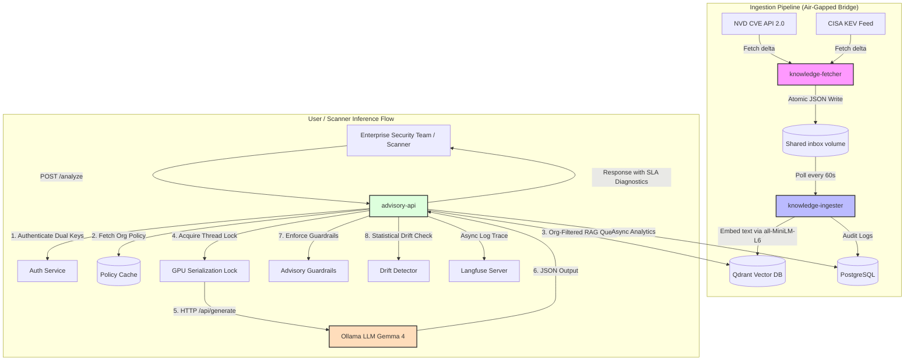

# On-Premises Self-Hosted AI Security Advisory Platform

An enterprise-grade, microservice-based security advisory platform designed to run entirely on-premises, enabling organizations to ingest raw vulnerability data (NVD CVEs, CISA KEV feeds), index it in a multi-tenant vector database, and generate production-ready security advisories using self-hosted LLMs under strict VRAM and latency constraints.

---

## 1. What This System Accomplishes
Large enterprise security teams often operate in highly restricted environment zones (air-gapped networks, SOC domains) where sending proprietary source code or infrastructure scans to public LLM endpoints (like OpenAI or Anthropic) violates compliance, data sovereignty, and security policies.

This platform solves this data leak hazard by providing a **completely self-hosted, air-gapped security co-pilot**. It ingests CVE feeds, structures them dynamically via SentenceTransformers, stores them in Qdrant with tenant-level isolation, and leverages on-premises GPU acceleration (tested on NVIDIA Quadro P1000/Xeon architectures) to generate high-fidelity, policy-aligned, and validated security advisories for downstream scanner alerts (Snyk, SonarQube, Trivy).

---

## 2. Technical Architecture & Network Map

The system is split into two primary pipelines:
1. **The Asynchronous Knowledge Feeds Pipeline (Ingestion)**: Scrapes external security databases, writes to a secure shared local storage volume, processes, embeds, and indexes data into Qdrant.
2. **The Synchronous Advisory & Analytics Engine (Inference)**: Direct user or scanner interaction via FastAPI, performing RAG retrieval, policy prompt shaping, Ollama inference, guardrail validation, drift detection, and Langfuse tracing.



---

## 3. The 8-Step Request Lifecycle
When a vulnerability finding is submitted to `POST /analyze`, it undergoes a strict synchronous lifecycle to guarantee deterministic output, strict service boundaries, and absolute tenant data isolation:

1.  **Ingestion & Auth Validation:** The gateway extracts organization metadata (`org_id`) and authenticates the requester using either a JWT bearer token (user role checks) or an HMAC service-to-service signature (with a 5-minute replay prevention window).
2.  **AI Policy Profile Resolution:** The system retrieves the tenant’s custom policy profile (e.g., SOC 2 compliance constraints, strict remediation instructions) from the cache. If no custom policy exists, the global default policy is loaded.
3.  **Context-Aware Context Retrieval (RAG):** The raw finding is embedded using a thread-safe `SentenceTransformer` module. A cosine similarity query is dispatched to Qdrant, strictly isolated using Qdrant’s payload metadata filters matching the tenant’s `org_id` (preventing cross-tenant data leaks).
4.  **Self-Healing & Load-Aware Degradation:** The advisory engine queries the model's rolling health status. If a latency spike is detected (latency exceeding the 8,000ms SLA) or a confidence decline is observed, the system self-heals by automatically degrading prompt verbosity or severity sensitivity to preserve throughput.
5.  **Multi-Model Dynamic Selection:** The model manager determines the optimal target model based on user override, tenant allocation, or hot-reload configurations (e.g., routing heavier workloads to a larger parameter candidate or smaller workloads to cost-optimized candidates).
6.  **GPU-Serialized Ollama Inference:** Since VRAM is tightly constrained in on-prem towers (e.g., 4GB on Quadro P1000), a `threading.Lock` forces sequential inference calls to Ollama. The client POSTs to Ollama's `/api/generate` endpoint enforcing strict JSON schema output.
7.  **Trust Guarantee & Guardrail Verification:** The generated advisory is parsed defenses-first. It is scanned for hallucination markers, validated against minimum text lengths, and verified against trust criteria (e.g., must contain remediation steps, confidence score >= 0.60).
8.  **Output Drift & Observability Auditing:** The output is compared against a 7-day rolling baseline for statistical drift (confidence drop, description length variance). Traces are queued to Langfuse, analytics are persisted in PostgreSQL, and the final structured JSON advisory is returned.

---

## 4. Architectural Reasoning: The Tech Stack

### FastAPI (Async Framework)
*   **Why:** Provides high-throughput async processing for bridging fast operational checks (auth, database queries) with slow LLM executions. Auto-generates OpenAPI documentation and integrates smoothly with background tasks for non-blocking logging.

### Ollama (LLM Inference Engine)
*   **Why:** The standard for hosting open-source LLMs on local hardware. The API allows direct parameter controls (temperature, context window size) and supports standard quantization templates to run large-parameter models (like Gemma 4) on standard system builds.

### Qdrant (Vector Database)
*   **Why:** Ultra-fast similarity search written in Rust. Crucially, Qdrant supports complex metadata payload filtering (via `org_id`) directly at the vector index level, ensuring absolute multi-tenant partition isolation without the latency penalty of post-filtering.

### PostgreSQL (System State & Analytics DB)
*   **Why:** ACID compliance is mandatory for maintaining security audit trails and model promotion configuration trees. PostgreSQL's JSONB type is utilized for flexible audit log schemas and fast statistical rollups.

### Langfuse (Observability Platform)
*   **Why:** Essential for monitoring open-source LLM performance. It traces prompt variations, audits tokens, tracks pipeline latency, and maps validation scores directly back to specific model versions, completely self-hosted inside Docker.

---

## 5. Reliability Engineering

To ensure stability in resource-constrained environments, the following resilience patterns are baked into the core engine:

> [!NOTE]
> **GPU Serialization Thread Lock:**
> Multiple simultaneous model loading or inference calls on a low-VRAM GPU (4GB) will result in a hard CUDA Out-Of-Memory (OOM) crash. The platform implements a thread-safe `RLock` wrapper around Ollama client calls, allowing safe, sequential request queueing while keeping memory utilization predictable under high load.

*   **RAG Circuit Breaker:** If Qdrant encounters network timeouts or connection drops, the circuit breaker transitions from `CLOSED` to `OPEN`, immediately bypassing the vector search step. The advisory engine gracefully degrades to run in zero-context mode rather than throwing errors.
*   **Statistical Drift Detection:** Compares generated advisories to a 7-day rolling baseline of successful outputs across four dimensions (rolling median confidence, remediation step count variance, severity distribution, risk score shift). If drift is detected, the confidence value is systematically lowered, a warning is logged, and A/B test parameters are adjusted.
*   **Self-Healing Graceful Degradation:** If a model's average latency crosses the 8-second SLA threshold, the system automatically degrades the verbosity level of future prompts (e.g., from `detailed` to `concise`). This saves up to 40% in output tokens and restores the request loop to SLA compliance.

---

## 6. Project Structure

```
.
├── docker-compose.yml                 # Main multi-service orchestration manifest
├── .env.example                       # Redacted environment config template
├── .gitignore                         # Standard ignore file (excluding local nodes/caches)
│
├── advisory-api/                      # FastAPI Backend & Core Advisory Engine
│   ├── Dockerfile
│   ├── requirements.txt
│   ├── migrations/                    # Database indexing and patching scripts
│   │   ├── 001_add_indexes.sql
│   │   └── 002_fix_indexes.sql
│   ├── app/
│   │   ├── main.py                    # Gateway application, lifespan, CORS, and router registration
│   │   ├── config.py                  # Pydantic base configuration and worker sync engine
│   │   ├── schemas.py                 # Input and output validation schemas
│   │   │
│   │   ├── routers/                   # Modular API routers
│   │   │   ├── advisory.py            # Core advisory generation & mock auth
│   │   │   ├── analytics.py           # Metrics, cost stats, and SSE streams
│   │   │   ├── model.py               # Model health summaries, reloading, configs
│   │   │   ├── optimization.py        # Recommendations, promotions, effectiveness
│   │   │   ├── health.py              # Diagnostic readiness checks
│   │   │   ├── config.py              # Settings configuration CRUD
│   │   │   └── knowledge.py           # Qdrant statistics and semantic search
│   │   │
│   │   ├── adapters/                  # Security scanner adapters (Snyk, SonarQube, etc.)
│   │   ├── analytics/                 # DB-backed operational metrics collector
│   │   ├── auth/                      # Dual JWT and HMAC authentication layer
│   │   ├── db/                        # Database ORM session and model definitions
│   │   ├── drift/                     # Rolling baseline output drift detector
│   │   ├── optimization/              # Automated model promotion engine
│   │   ├── validators/                # Guardrails trust guarantee verifier
│   │   │
│   │   ├── advisory_engine.py         # Primary RAG co-pilot orchestrator
│   │   ├── ollama_client.py           # Thread-locked Ollama client wrapper
│   │   ├── vector_store.py            # Cosine-indexed multi-tenant Qdrant client
│   │   ├── context_retriever.py       # RAG context retriever
│   │   ├── embedding.py               # Thread-safe offline embedding generator
│   │   ├── prompt_shaper.py           # System prompt shaper
│   │   ├── circuit_breaker.py         # Retrying circuit breaker
│   │   ├── model_manager.py           # Cluster-wide model configuration cache
│   │   ├── model_health.py            # In-memory latency tracker & summary generator
│   │   ├── health.py                  # Dependency check scripts
│   │   ├── metrics.py                 # Prometheus-compatible metrics registry
│   │   ├── tracing.py                 # Langfuse observability no-op wrapper
│   │   ├── risk_engine.py             # Severity risk mapping calculations
│   │   ├── bootstrap_knowledge.py     # Initial seed co-pilot knowledge script
│   │   ├── ollama_setup.py            # Background startup model downloader
│   │   └── utils.py                   # Strict parser helpers for unstructured output
│   └── tests/
│       └── test_generation.py         # Pipeline and circuit breaker mock tests
│
├── knowledge-fetcher/                 # Internet-Facing CVE Fetching Worker
│   ├── Dockerfile
│   ├── requirements.txt
│   ├── fetcher/
│   │   ├── main.py                    # scheduled fetching loop (CISA/NVD feeds)
│   │   ├── writer.py                  # Atomic storage bridge file writer
│   │   └── sources/                   # Scraper integrations (NVD v2, CISA KEV)
│   └── tests/                         # Fetcher validation test suite
│
├── knowledge-ingester/                # Air-Gapped Vector Ingestion Worker
│   ├── Dockerfile
│   ├── requirements.txt
│   ├── ingester/
│   │   ├── main.py                    # Polling loop for local inbox file scanning
│   │   ├── processor.py               # Embedding computation and Qdrant indexing
│   │   └── audit.py                   # PostgreSQL transaction tracking logger
│   └── tests/                         # Ingest processing tests
│
├── dashboard/                         # Vite + React Control Plane Dashboard
│   ├── Dockerfile
│   ├── nginx.conf                 # SPA Nginx config optimized for SSE streams
│   └── src/
│       ├── App.tsx                    # Routes, react-query clients, providers
│       ├── index.css                  # CSS custom properties and dark theme
│       ├── api/                       # API integration handlers (localStorage JWT)
│       ├── hooks/                     # useSSE event listeners and REST queries
│       └── pages/                     # Interactive governance panels & load tester
│
├── langfuse/                          # Self-hosted Langfuse configuration settings
│   ├── clickhouse-config.xml          # Clickhouse memory allocation settings
│   └── init-minio.sh                  # S3 mock bucket bootstrap scripts
│
└── docs/                              # Deep-dive system documentation
    ├── deployment.md                  # Detailed server setup guide
    ├── api-contract.md                # REST API payload structures
    ├── policy-profiles.md             # Security policy variables
    └── drift-detection.md             # Drift detection algorithms
```

---

## 7. REST API Integration Examples

### 7.1 Authenticate & Get Access Token

```bash
curl -X POST "http://localhost:8000/login?username=security-operator&role=security_analyst"
```
#### Response:
```json
{
  "access_token": "eyJhbGciOiJIUzI1NiIsInR5cCI6IkpXVCJ9...",
  "token_type": "bearer"
}
```

### 7.2 Analyze Finding & Generate Advisory

```bash
curl -X POST "http://localhost:8000/analyze" \
  -H "Authorization: Bearer <access_token>" \
  -H "Content-Type: application/json" \
  -d '{
    "title": "SQL Injection in User Authentication",
    "description": "The password reset form does not sanitize the input email parameter, allowing raw SQL queries to pass directly to the database.",
    "severity": "High",
    "affected_asset": "auth-service-v2",
    "evidence": "POST /reset-password HTTP/1.1\nHost: auth.internal\nemail='\'' OR '\''1'\''='\''1",
    "org_id": "finance-division-corp",
    "risk_tolerance": "low",
    "verbosity": "detailed",
    "remediation_style": "strict"
  }'
```

#### Response:
```json
{
  "finding": "SQL Injection in User Authentication",
  "advisory": {
    "risk_summary": "An unauthenticated remote attacker can inject arbitrary SQL commands via the email input field, bypassing logical authentication checks to view or alter sensitive database tables.",
    "business_impact": "Loss of data integrity and confidentiality for all user accounts, leading to regulatory SOC 2 violations, potential breach disclosure penalties, and systemic reputational damage.",
    "severity": "Critical",
    "remediation_steps": [
      "Use prepared statements or parameterized queries in all database lookup methods.",
      "Implement input validation utilizing an allow-list schema for valid email shapes.",
      "Examine database logs for unauthorized queries originating from the reset-password API gateway."
    ],
    "confidence": 0.94
  },
  "risk_assessment": {
    "risk_score": 89,
    "risk_level": "Critical",
    "sla": "24h",
    "justification": "Critical risk based on severity, asset criticality, and AI confidence"
  }
}
```

---

## 8. Local Setup & Fast Start

### Prerequisites
*   Operating System: Ubuntu Linux (LTS recommended) or Windows
*   Docker & Docker Compose (V2)
*   *Recommended:* NVIDIA GPU (Pascal architecture or newer) with NVIDIA Container Toolkit configured.

### Step 8.1: Initialize the Environment
```bash
# Clone the repository
git clone https://github.com/your-org/Self-Hosted-AI-Security-Advisory-Platform-LLM.git
cd Self-Hosted-AI-Security-Advisory-Platform-LLM

# Generate environment configuration
cp .env.example .env
```
*(Customize values inside `.env` such as PostgreSQL passwords and secret keys).*

### Step 8.2: Start the System
```bash
# Build and run the core services (FastAPI, Qdrant, PG, Workers, Dashboard)
docker compose up -d --build
```
*Note: If you want to spin up the observability stack as well, add the Langfuse profile:*
```bash
docker compose --profile langfuse up -d
```

### Step 8.3: Verification
*   **Advisory API (Gateway):** `http://localhost:8000/docs`
*   **Control Plane Dashboard:** `http://localhost:80`
*   **Qdrant Vector Console:** `http://localhost:6333/dashboard`
*   **Langfuse UI:** `http://localhost:3000`

---

## 9. Realistic Future Roadmap

*   **Conversational Security Copilot:** Transition from static single-response advisory generation to a multi-turn chat experience, allowing operators to interrogate finding contexts and customize remediation steps interactively.
*   **Multimodal Evidence Ingestion:** Allow ingestion of system topology diagrams, source code snippets, and network packet capture (PCAP) images, feeding them to local vision LLMs for richer vulnerability mapping.
*   **Federated GPU Inference Clusters:** Scale out VRAM capabilities by pooling idle GPU resources across the enterprise, distributing large-model inferences (e.g., 31B+ parameters) dynamically across a local cluster.
*   **Self-Tuning Reinforcement Feedback Loops:** Leverage human analyst ratings of advisory quality to retrain small custom adapter checkpoints (LoRA) locally, systematically improving explanation style and risk scores over time.
